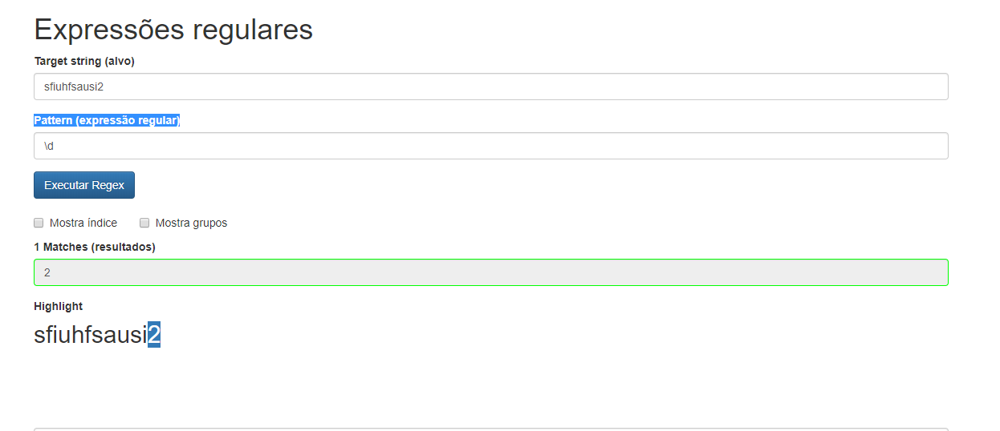

# Utilização

## - Para utilizar o validador de regex, é bem simples.

- Coloque sua string para validar no 'Target string (alvo)'
- Coloque o código regex (ele aceita groups, quantifiers, etc) no 'Pattern (expressão regular)'

## No exemplo abaixo, segue um exemplo de uma palavra qualquer que quer saber onde está o numero.
    Como a expressão '\d' solicitado numeros
    Portanto ele irá demarcar e falar quais resultados foi possível pegar

